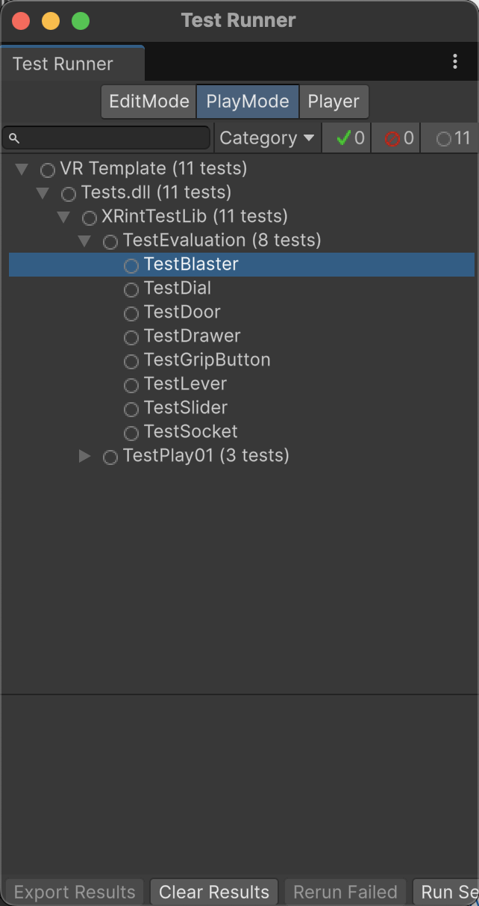

# IntenXion

IntenXion is a test automation framework for XR applications developed with Unity, providing a set of testing APIs.

The repo contains the API set and the Unity XR project `VR Template` for our evaluation.

# Background

How to test Unity projects with Unity Test Framework: [Testing your code](https://docs.unity3d.com/6000.2/Documentation/Manual/test-framework/test-framework-introduction.html)

# Instructions

### Test Assembly

1. Create a test assembly following the guidelines provided by Unity Test Framework.
2. Set the assembly to support Play mode tests.
3. Add necessary Assembly Definition References (dependencies of the tests).


4. Alternatively, copy the `/IntenXion/lib/Tests.asmdef` to the `/Assets/Tests` folder of the Unity XR project under test.

### Write test cases

1. Copy the `.cs` files in the `/IntenXion/lib` to the `/Assets/Tests` folder.
2. Follow the templates provided by `TestTemplate.cs` to develop your test cases.

```c#
// Template TestGrabCube: grab a cube and move it and confirm it is moved
[UnityTest] // Ensure use a [UnityTest] attribute
public IEnumerator TestGrabCube()
{
    var cubeObj = FindXRObject("Cube Interactable"); // Find the target object
    var cubePosition = cubeObj.transform.position;
    Assert.IsNotNull(cubeObj, "Cube Interactable not found in the scene.");
    // 1. Navigate origin to Cube Interactable
    yield return new ActionBuilder()
            .NavigateTo(origin, cubeObj)
            .Execute();
    // 2. Move controller to Cube Interactable
    yield return new ActionBuilder()
            .MoveControllerTo(rightController, cubeObj)
            .Execute();
    // 3. Grab the cube and move it using ActionBuilder pattern
    var action = new ActionBuilder();
    action.GrabHold(1.0f)
          .MoveUp(0.5f)
          .ReleaseAllKeys();
    yield return action.Execute();
  	// Assertion: confirm the cube is grabbed
    AssertGrabbed(cubeObj, "Cube should have been grabbed");
    // Assertion: confirm the cube is moved
    AssertTranslated(cubeObj, cubePosition, "Cube should have been moved");
    yield return new WaitForSeconds(1.0f);
}
```

### Exeute test cases

1. In Unity Editor, open **Window > General > Test Runner**.
2. Select **PlayMode** in the **Test Runner**.
3. Find the test case(s) you would like to execute, double click it or click **Run Selected test(s)**.



* Currently, the Test Runner only supports executing one single test case, running multiple tests in one execution will cause errors. The issue is reported to Unity to be resolved. Unity Issue Link: [IN-111168](https://unity3d.atlassian.net/servicedesk/customer/portal/2/IN-111168).

# Examples

## Basic Usage

```c#
// Create an action sequence with ActionBuilder
var action = new ActionBuilder(this);
// Add action GrabHold (holding grab for 1 second) to the ActionBuilder
action.GrabHold(1.0f) 
// Add action MoveUp (moving upward for 0.5 second) to the ActionBuilder
      .MoveUp(0.5f); 
// Execute the actions constructed with the ActionBuilder
yield return action.Execute();
```

## Available APIs

### Navigation

* `NavigateTo`

### Selection

* `MoveControllerTo`
* `Grab`
* `GrabHold`
* `Trigger`
* `TriggerHold`

### Manipulation

* `MoveUp`
* `MoveDown`
* `MoveForward`
* `MoveBackward`
* `MoveLeft`
* `MoveRight`
* `RotateUp`
* `RotateDown`
* `RotateLeft`
* `RotateRight`
* `ReleaseAllKeys`

### Assertion

* `AssertGrabbed`
* `AssertTriggered`
* `AssertTranslated`
* `AssertRotated`

